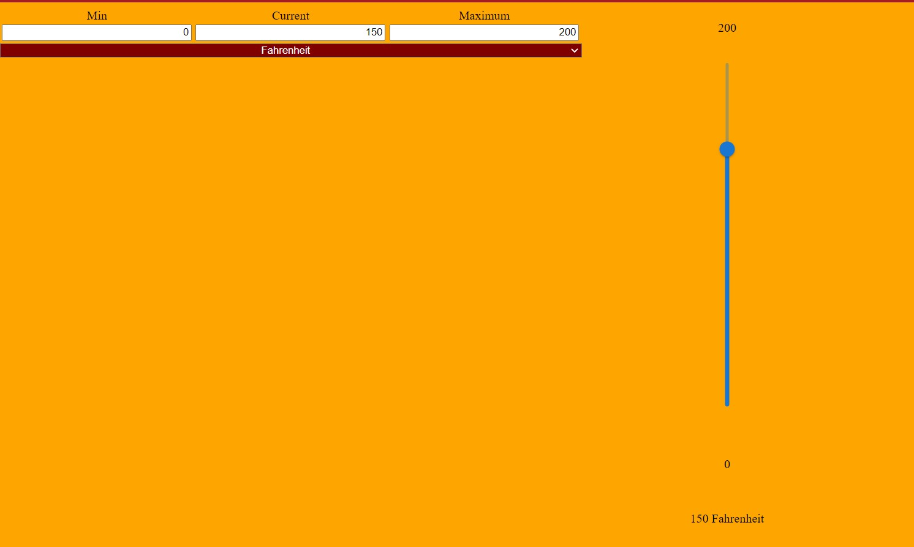

# React-Temperature-Display
A temperature display made with React and MUI.

This program displays temperature input for the Celsius, Fahrenheit, and Kelvin scales. Inputs checked for validity (values cannot be unreal values like 0 K, current temp cannot be outside of min-max range, etc.) and the display is updated when the user clicks away from the input box.

